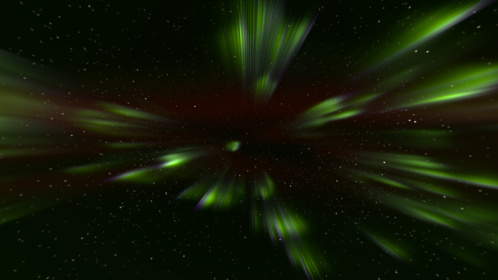
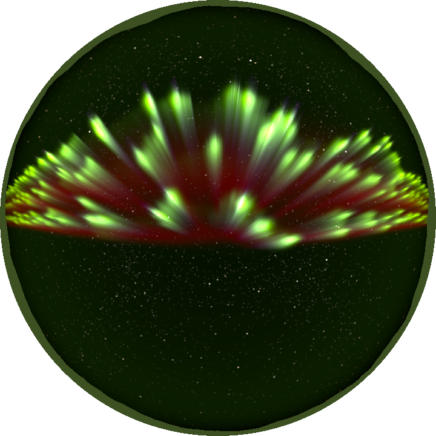

# boreal

> **AI-assisted project.** This codebase was created with [Claude](https://claude.com/claude-code)
> (Anthropic), directed and reviewed by a human author. It has **never been
> loaded into Resolume**. Everything below is measured by an offline harness
> that drives the real plugin classes in a headless GL context, and the checks
> run against the physics, not against screenshots. `brtest --kh` grows a wave
> on the plugin's own vortex sheet and matches the growth rate derived for its
> regularised kernel to **10⁻⁹**. `--deposition` puts the ionisation peaks
> within **1.5 km** of Fang et al.'s published figure. `--quench` holds the
> red/green ratio the GPU samples to the collisional-quenching formula at every
> height, and `--lifetime` holds the populations to the exponential decay the
> table says. `--corona` finds the rays' vanishing point within **0.3 px** of
> the magnetic zenith at three rasters and in both hemispheres. `brtest
> --negative` re-runs fourteen checks against deliberately wrong models, and
> `tools/mutate.sh` changes one character of the shipped shaders and engine;
> every one is caught. A control sweep fails if any parameter does nothing
> (see [Status](#status)).

The aurora borealis and australis for Resolume Arena/Avenue, as two FFGL
plugins: **SW Boreal**, a source that is the night sky, and **SW Boreal Over**,
an effect that adds the aurora to your clip as light.

A corona, a few minutes after a substorm: four arcs overhead at
moderate solar activity, looking up the field line. Every ray points at the
magnetic zenith because it IS a field line, seen in perspective. Rendered by
the plugin's offline harness (`brtest`), not captured from Resolume.

**[Try it in your browser](https://boreal-demo.stoatworks-labs.com)** — both
plugins' six GLSL passes, copied unedited and run in WebGL2, over a JavaScript
port of the vortex sheet and the emission tables, with every control and every
preset. It is a port and not the plugin: the sheet is capped at 1024 nodes
rather than 4096 and nothing audio is there. Read
[what the page itself says it does not reproduce](https://boreal-demo.stoatworks-labs.com).

## The one idea

**An auroral arc is a sheet of electric charge drifting in crossed electric
and magnetic fields — and a charge sheet drifting at E×B is a vortex sheet.**
The drift velocity is ẑ×∇φ/B, so the electric potential is a stream function
and the space charge is its vorticity. A thin arc therefore obeys the same
equations as a thin sheet of spinning fluid, and it is unstable in the same
way: it rolls itself up (Hallinan & Davis 1970).

So nothing is drawn with a noise function. The **curls**, the **folds** and the
westward-rolling **surge** of a substorm are one instability at different
scales, and **Curl Size** is a physical length: the smoothing length of the
sheet, which sets the wavelength that grows fastest. Four more models follow,
with every constant in the open:

- **Precipitation.** Where the sheet is wound up tight, the current along the
  field is high, and by the Knight relation so is the electrons' energy. The
  brightest curls are the hardest.
- **The atmosphere.** The electrons' energy goes into a real atmosphere
  (NRLMSIS) at the heights Fang et al.'s parameterisation gives, and excites
  each spectral line by its own chemistry.
- **Lifetime.** The green line's atoms live 0.7 s before they glow, the red
  line's minutes — and at low altitude the red ones are knocked out of it by
  collisions first. So **the red lives above 200 km, lags behind a moving curl
  and lingers** after it; nobody places it there.
- **A camera on the ground** looks up through all of it, on a curved Earth,
  with the air in between dimming and reddening what is low.

What falls out rather than being arranged:

- the **pink/violet lower border** of a hard display (the green needs oxygen,
  which thins below 100 km; nitrogen does not);
- the **corona** overhead, rays converging on the magnetic zenith, and arcs on
  the horizon shrinking to bands;
- **red tops** that rise with solar activity;
- the faint **airglow** band low in every long exposure (its brightening toward
  the horizon is geometry);
- **snow that goes green** under a strong display (the Over effect's
  Illumination, and the source's ground).

The same sky as a research all-sky camera records it: equidistant
fisheye, north up, east on the left. Rendered by `brtest`.

## Controls

- **Sky:** Hemisphere (*Borealis*/*Australis* — the oval moves to the other
  side of the sky and the curls turn the other way), Oval Distance (km poleward
  of you; negative puts it overhead or behind), Dip, Declination, Speed (sky
  time: 0 freezes, 1× is real time, up to 64×), Seed.
- **Arcs:** Arcs (1–5), Arc Spacing, Sheet Strength (the shear, km/s), Curl
  Size, Disturbance, Drift, **Substorm** (the sheet jumps, the poleward arc
  brightens and surges west) and **Calm** (straight arcs again).
- **Precipitation:** Energy (keV), Flux (erg cm⁻² s⁻¹), Knight (0 = every
  curl at the base energy, 1 = the Knight relation), Thickness, Rays.
- **Atmosphere:** Activity (solar minimum to maximum), Neutral Wind (drifts
  the red haze), Airglow, Extinction.
- **Camera:** Camera (*Rectilinear*/*Fisheye*), Look Azimuth, Look
  Elevation, Field of View, Roll, Exposure, Observer (*Camera* keeps the
  sensor's colour; *Eye* is the dark-adapted eye, CIE 191 mesopic: faint aurora
  goes grey-green and the red nearly vanishes), Stars, Star Motion, Horizon
  (*None* — transparent below the horizon — *Flat*, *Hills*), Detail (the ray
  march's resolution).
- **Audio:** Audio (Resolume's FFT buffer), Audio Substorm (each onset is a
  substorm), Audio Flux (the level brightens the display).
- **Preset:** *Boreal* (the defaults), *Quiet Arc*, *Corona*, *Red Storm*,
  *Rayed Band*, *Australis*, *Eye*.
- **Over only:** Sky Mask (*Everything*, *Alpha* — the clip's transparent
  sky becomes the night sky — or *Dark Areas*), Mask Threshold, Illumination,
  Mix.

## Status

**v0.1.0, 2026-09-23, and honestly early.**

It has **never been loaded into Resolume**. `oxbow probe` reads the bundles as
a host does (`SW Boreal` / `BR01` / source, `SW Boreal Over` / `BR02` /
effect) and `oxbow selftest` renders 120 frames through each. Nothing else has
run them. There is a [user guide](docs/USER-GUIDE.md) and a
[browser demo](https://boreal-demo.stoatworks-labs.com) (a port, not the
plugin); no OpenFX port. Built and
measured on macOS (Apple Silicon, M4 Max) only; the Windows build is in CI and
has never been run.

What is measured, on this machine:

| | |
| --- | --- |
| KH growth | a single mode on the plugin's sheet grows at the derived σ(k, δ) to **2.6×10⁻¹⁰–8.7×10⁻¹⁰ /s** at λ = 512, 256, 128 km; as δ → 0, σ/(γk/2) rises 0.488 → 0.695 → 0.833 → 0.912 toward 1 |
| invariants, 10 min | circulation to **8×10⁻¹⁵** relative; impulse to rounding between insertions; the Hamiltonian's integrator drift **5×10⁻¹⁴** (16× smaller at half the step, as RK4 must be), **3.3×10⁻⁶** through 4756 insertions, shrinking 3.2× when the spacing halves |
| Knight | E₀ ∝ local sheet strength to **1.6×10⁻⁷** on a sheet wound up 0.05–3× |
| deposition | peaks at **118.7 km** (1 keV) and **96.7 km** (10 keV); Fang 2008 Fig. 3a reads 120 and 97.5; Fang 2010 integrated agrees to 0.5 km; the table conserves energy exactly |
| quenching | red/green against the formula at all 721 heights to **1.6×10⁻⁷**; at 5 keV 630.0 nm peaks at **221 km**, 557.7 nm at **104 km** |
| lifetime | with the flux off, 557.7 (τ 0.705 s) and 630.0 (τ 40.9 s) decay as e^{−t/τ} to **8×10⁻⁶** and **5×10⁻⁵** over 3 s and 20 s; 427.8 and 1P are exactly zero the next frame |
| colour | each line alone at its CIE 1931 chromaticity to the fifth decimal (557.7 nm at 0.3569, 0.6401 — outside sRGB, gamut-mapped at constant luminance) |
| corona | rays meet the magnetic zenith to **0.07–0.32 px**, 320×180, 640×360 and 1280×720, both hemispheres |
| airglow | brightens as van Rhijn's function to **8×10⁻⁷ kR** per kR, to 80° zenith, 257² and 513² fisheye (V(80°) = 4.12 against sec 80° = 5.76) |
| extinction | the shipped shader's airmass against Kasten & Young to **9×10⁻⁷**, transmission to **1.2×10⁻⁵**, 8 wavelengths × 91 angles |
| Over | Mix 0, and no light, return the clip **bit-exact**; the Alpha mask keeps every opaque pixel exact |
| determinism | the same seed gives bit-identical frames through a substorm with the worker thread; a different seed does not |
| audio | the first hit after a clip trigger fires a substorm (the primed analyser) |
| GL state | viewport, vertex array, array buffer, program, unit, framebuffer, blend, scissor, clear colour, ten texture units, both plugins |
| negative controls | **14** deliberately wrong models, **all 14** detected |
| mutants | **3** one-character changes (two GLSL, one engine), **all 3** caught |
| dead controls | **39** parameters over both plugins, all live |
| browser demo | its ten shader pieces, the NRLMSIS table and the seven preset rows are byte-identical to the plugin's (`demo/tools/check_shaders.py`); its JavaScript port of the CPU half is checked by nobody but a reader |

Render cost (`brtest --bench`, the defaults, Detail Half, the median frame):
**4.4–9 ms at 720p, 6–12 ms at 1080p, 15–32 ms at 4K** — the spread is
between runs on a machine shared with other builds. Use Detail Quarter at 4K.
The vortex sheet costs **0.4 ms** per RK4 step at 512 nodes, **3.8–4.1 ms** at 2048
and **13–15 ms** at the 4096-node cap (four threads); a step is 0.8 s of sky time
at the defaults, so at 4× one frame in twelve waits for it.

What is **not** verified, and is the honest limit of this release:

- **Some yields are assumptions.** The green line's is calibrated to the
  textbook ~1 kR per erg; the red and the N₂ first positive are assumed (see
  AGENTS.md). The heights and the lifetimes are physics; the brightness of red
  and pink against green is partly a choice.
- **One lifetime and one vertical shape per line.** Exact in steady state; a
  real column decays height by height.
- **The O(¹D) Einstein A is NIST's current 7.5×10⁻³ s⁻¹** (τ 134 s), not the
  older 0.0091 the spec quotes.
- **The red haze's transport** (wind and diffusion) is not checked, and the
  resampling adds diffusion of its own near the horizon.
- **Curtains thinner than the footprint map's texel** (0.6 km overhead, ~8 km
  at 1000 km) are widened to it, at constant integrated brightness.
- **At the node cap** (4096) the curls stop being refined; the defaults reach
  it after about a minute of sky time.
- **Eye** adapts per pixel, which CIE 191 does not.
- "Curtain Thickness" is **Thickness**: FFGL names stop at 16 characters.
- Rays are the one stochastic texture, a seeded spectrum standing for
  field-aligned filamentation the model does not resolve.

No OpenFX port yet. The browser demo is a port, not a measurement: WebGL2
gives GLSL ES 3.00, not desktop GL 4.1 core, and nothing on the page checks
anything.

## Build

C++17 + GLSL 4.10, CMake, FFGL 2.1 (SDK vendored as a submodule). macOS builds
are universal (arm64 + x86_64); Windows needs GLEW via vcpkg.

    git clone --recursive https://github.com/stoatworks-labs/boreal
    cmake -B build -DCMAKE_BUILD_TYPE=Release
    cmake --build build
    cmake --install build          # both bundles into Resolume's Extra Effects

## Building and testing

The offline harness renders the real plugin classes headlessly:

    ./build/brtest --out /tmp/sky.png --frames 600 --substorm 300   the source
    ./build/brtest --over --out /tmp/over.png                       the effect, on a night scene
    ./build/brtest --kh               the growth rate of the sheet against sigma(k, delta)
    ./build/brtest --invariants       circulation, impulse, Hamiltonian over 10 min
    ./build/brtest --knight           E0 follows the sheet strength
    ./build/brtest --deposition       Fang 2008 against Fang 2010 and the paper's figure
    ./build/brtest --quench           red/green by the quenching formula, and where each peaks
    ./build/brtest --lifetime         the populations decay as the table says
    ./build/brtest --colour           each line at its CIE chromaticity
    ./build/brtest --corona           rays converge on the magnetic zenith, three rasters
    ./build/brtest --vanrhijn         the airglow's brightening, two rasters
    ./build/brtest --extinction       the shipped shader's Kasten & Young
    ./build/brtest --over-check       the clip untouched where it must be
    ./build/brtest --determinism      same seed, same frames
    ./build/brtest --onset            the first hit after a trigger counts
    ./build/brtest --defaults --names --state
    ./build/brtest --negative         every check above, against a wrong model
    ./build/brtest --offline          the no-GL subset and its negative controls (what CI runs)
    tools/mutate.sh                   one character changed, a check must fail
    python3 tools/sweep.py            no control is silently dead
    ./build/brtest --bench            720p through 4K
    ./build/brtest --engine           the sheet's CPU cost
    tools/verify.sh                   all of it, in about three minutes

Filming uses the fleet's frame format and cue sheets:

    ./build/brtest --film 1800 --size 1280x720 --script docs/demo.cues \
      | ffmpeg -f rawvideo -pix_fmt rgba -s 1280x720 -r 60 -i - demo.mp4

<!-- attributions:start -->
This project is built on other people's work — see [ATTRIBUTIONS.md](ATTRIBUTIONS.md).
<!-- attributions:end -->

## Licence

MIT.

The physics is from the papers: Hallinan & Davis and Hallinan on arcs as vortex
sheets, Krasny on the regularised sheet, Knight's current–voltage relation,
Fang et al.'s ionisation parameterisations, NRLMSIS, the NIST atomic data, the
rate coefficients as GLOW uses them, the CIE colour-matching functions, Hansen
& Travis, Kasten & Young, van Rhijn and CIE 191. Nothing is copied from
anyone's source.
